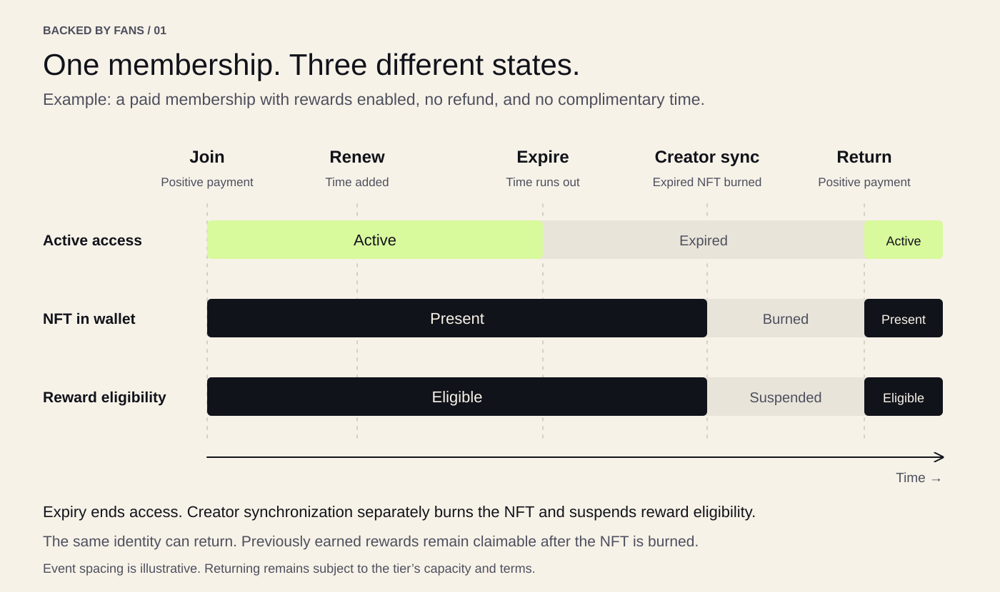
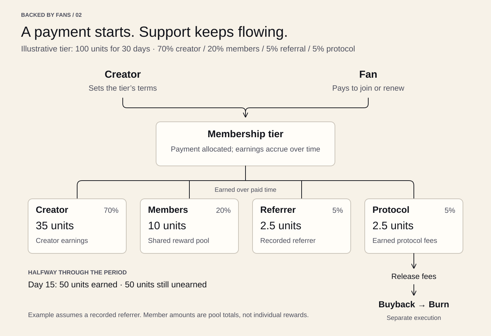
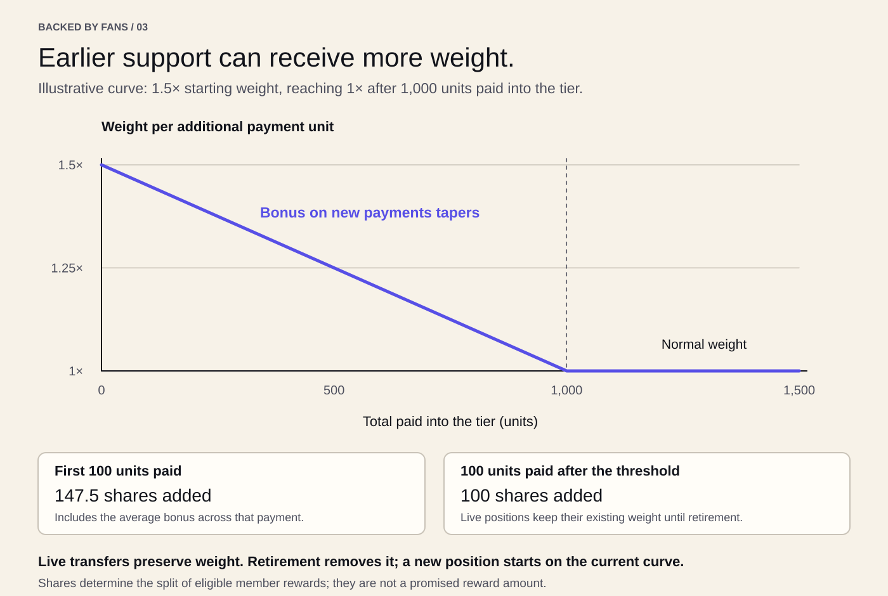

# Backed By Fans

## Creator-owned memberships

*Working draft · September 2026*

Backed By Fans lets creators offer memberships on their own terms. Fans pay for membership time and receive a transferable NFT that carries the membership and its accumulated reward weight. Creators decide what belonging means, from access to a private community to recognition of support for their work.

A membership is a prepaid subscription that fans renew manually. Each payment creates a membership or adds time to a selected live membership. As that time is used, the payment is earned by the creator and, where enabled, shared with members and a referrer. A portion goes to the protocol, exclusively to buy and burn the protocol token.

This connects payment to an ongoing membership. Paying for several months does not make the entire payment immediately available to the creator or reward recipients. It funds the months ahead, with value earned throughout that period.

## Membership on the creator’s terms

A creator can offer one membership or several tiers. Each tier has its own price, payment currency, period length, and reward terms. A musician might offer a supporters’ community, a writer might provide access to a private website, and an artist might use membership simply to recognize the people supporting their practice.

The membership NFT gives creators a common way to recognize fans across these experiences. A Discord server, website, or other application can check that a wallet owns a particular membership and that its time has not expired. Creators can build these experiences themselves or use services that support the membership contracts.

The benefits come from the creator. The protocol records membership and handles payments and rewards; it does not deliver content, operate a community, or guarantee the benefits described by a creator.

### Terms that stay fixed

When a creator publishes a tier, its core terms become permanent:

- The tier’s name and symbol.
- Its payment currency, price per period, and period length.
- Its minimum positive payment.
- The percentages allocated to member rewards, referrals, and the protocol.
- The rules determining how much reward weight each payment creates.

Fans can review these terms before joining. A creator cannot later raise the price of that same tier, change its currency, or reduce its member-reward percentage. Different economic terms require a new tier.

The protocol allocation must be at least 1% of each payment. The creator chooses the tier’s allocation within the contract’s limits. Member and referral rewards are optional; either percentage can be zero. The creator receives what remains after the applicable allocations.

### What can evolve

Creators can update a tier’s description, website, and NFT artwork. These updates can affect existing memberships as well as new ones. Artwork can use the built-in styles or a custom onchain design.

Creators can also change membership capacity and the amount of time fans may prepay. Capacity counts membership positions, so two NFTs owned by one wallet occupy two places. A capacity reduction cannot go below the number of occupied places, and a new prepayment limit does not remove time already purchased.

A creator may pause new membership time additions, give complimentary time, revoke unused complimentary time, or refund unused paid time. Pausing does not stop the membership clock or undo earnings. Live transfers, approvals, maintenance, and claims remain available while paused. Revoking complimentary time preserves any remaining paid time; if no time remains, the position is retired.

Tier ownership can be transferred to a new owner. The new owner takes over these responsibilities and controls while the tier’s permanent terms remain in place.

## Joining, renewing, and returning

Joining creates a new membership NFT with its own token ID. A wallet can own several independent memberships in the same tier, each with its own time, reward weight, earnings, and referral choice. Creating another membership always creates another ID; it does not merge with an existing position.

Fans choose when to renew. There are no automatic recurring charges. Renewal selects an existing token ID and extends it before its membership expires. New paid time follows its remaining paid time, and paid time is used before complimentary time. At or after expiration, that ID cannot be renewed. Returning requires a new membership, subject to the tier’s capacity and terms.

A tier can also accept contributions instead of setting a fixed price. In that model, creating or renewing a selected membership adds one period. A fan can contribute zero or choose a positive amount that meets the tier’s minimum. A zero contribution adds time but funds no rewards or creator earnings and issues no reward weight.

Fixed-price gifts can create a new position for another wallet or fund a renewal of a selected live position. The membership receives the time and reward weight, regardless of who paid. Creators can similarly create a complimentary membership or add grant time to a selected live position. Complimentary time has no payment allocation or new reward weight. Gifts and grants must distinguish creation from extension.

### Moving a live membership

A transfer moves the entire membership position to its new owner. Its token ID keeps the remaining paid and complimentary time, accumulated weight, reward eligibility, unclaimed member rewards, funding history, and locked referral choice. The recipient can already own other memberships in that tier; the transferred position remains separate.

The new owner gains membership access and the authority to claim its rewards and renew it. The former owner loses those rights. Original payment records remain historical evidence of who funded the position; they do not give a former owner or payer authority over it.

An owner can approve another address to transfer an NFT, or approve an operator for their NFTs. Those approvals authorize transfers only. They do not authorize owner-only renewal, reward claims, or creator actions. A token-specific approval clears when the NFT transfers. A person may still sponsor a renewal under the same rules available to any payer.

Live transfers do not settle rewards or run accounting maintenance. A backlog of funding or expiration checkpoints cannot block an otherwise valid transfer, including while the tier is paused. The transfer leaves the position’s stored accounting and schedules unchanged and checks expiration directly against the transaction’s timestamp.

### Expiration and permanent retirement

Access ends at the membership’s expiration timestamp. From that timestamp onward, the NFT cannot transfer or receive more time, even if it is still present in the wallet awaiting maintenance. Applications must verify current ownership and active membership status; NFT possession alone is insufficient.

Anyone can process maintenance. It settles funding chronologically through each expiration before removing that position’s weight. A late maintenance transaction therefore gives the membership the rewards it earned through its actual expiration, without awarding it rewards for time after expiration. Funding ending at the same timestamp, including its rounding remainder, is settled before any position expiring then is retired.

Retirement permanently burns the NFT, destroys its reward weight, clears its live membership and referral association, and releases its occupied place once. Its already-earned member credit moves, without rounding away fractions, to a separate balance belonging to the owner at expiration. Funding history remains available under the retired ID.

Returning starts a separate position with a new ID and fresh referral state. A positive payment earns new weight at the tier’s current reward curve. Retirement and refunds never reduce lifetime payment volume or reopen an earlier point on that curve. A new membership does not inherit the retired position’s weight or consume its owner’s retired reward balance.

*Figure 1. Access ends at expiration. Maintenance completes permanent retirement at that historical boundary; returning creates a new position.*

## How payments become earnings

Each payment has four possible destinations:

| Recipient | What the allocation supports |
| --- | --- |
| Creator | Earnings from the membership |
| Members | Optional rewards shared among eligible memberships |
| Referrer | Optional rewards for the membership’s recorded referrer |
| Protocol | Fees available for protocol-token buybacks and burns |

The amounts are allocated when the payment is made. They are earned as its membership time is used.

This distinction matters when a fan prepays. A payment for an additional month is reserved for that month. It does not become immediately earned simply because the fan paid early. The same timing applies to creator earnings, member rewards, referral rewards, and protocol fees.

Once earned, creator proceeds and rewards can be claimed. Accrual describes how the amount grows over time; it does not mean tokens are transferred to every recipient’s wallet every second. Claims and protocol-fee release happen through transactions.

All four allocations use the tier’s payment currency. A membership priced in one currency does not automatically pay its member rewards in the protocol token.

### A payment over thirty days

Consider a tier charging 100 units of its payment currency for thirty days. Its terms allocate 70% to the creator, 20% to members, 5% to a referrer, and 5% to the protocol. These are illustrative percentages, not protocol defaults.

Assume the fan has no existing paid time and has a recorded referrer. With no refund or other change, the payment is earned as follows:

| Time used | Creator | Member rewards | Referrer | Protocol | Unearned |
| --- | ---: | ---: | ---: | ---: | ---: |
| At payment | 0 | 0 | 0 | 0 | 100 |
| Fifteen days | 35 | 10 | 2.5 | 2.5 | 50 |
| Thirty days | 70 | 20 | 5 | 5 | 0 |

The member-reward column is the amount shared by the pool, not an amount promised to any one fan. Each eligible membership receives a portion according to its reward weight during the time those rewards are earned.

If the membership has no recorded referrer, the referral portion goes to the creator. In this example, the allocation would become 75% creator, 20% members, and 5% protocol.

*Figure 2. All four allocations accrue over paid time. Earned protocol fees are released for separate buyback and burn execution.*

### Refunds

A creator can refund unused paid time. The refund is funded by the payment’s remaining unearned allocations. Already earned creator proceeds, rewards, and protocol fees are not taken back.

In the thirty-day example, a refund after fifteen days would return approximately 50 units and cancel the rest of the funded period. The exact amount follows the payment currency’s smallest units and the contract’s rounding rules.

A refund clears the membership’s remaining paid and complimentary time and permanently retires the position. Its NFT is burned, its weight is destroyed, and its occupied place is released. Rewards already earned, including fractions, remain separately claimable by the current NFT owner.

Only the tier’s current creator authority can initiate a refund or subscription cancellation. The refund is paid to the current NFT owner, including when another wallet originally paid, gifted, or previously owned the membership. NFT ownership and transfer approval alone do not authorize a refund. A fan can stop renewing, but cannot unilaterally demand an onchain refund for unused time.

## Sharing membership rewards

Creators can dedicate part of each payment to their members. This allows the community to participate in the membership activity it helps sustain.

Rewards can come from new fans joining, existing fans renewing, and gifts. A payment funding a position can also contribute to that position’s rewards; its current owner need not have made the payment. New reward weight participates in rewards earned after that weight is created, including later earnings from membership periods already underway. It does not receive a share of rewards earned before it existed.

### Reward weight

Positive payments add reward weight to the membership being funded. The contracts call this weight “shares.” Shares determine how the member-reward pool is divided and move with the NFT as part of the entire position. They cannot be transferred separately and do not represent ownership of the creator’s business.

For example, if two eligible memberships have equal weight throughout an interval, they split the rewards earned during that interval equally. If one has twice the weight of the other, it receives two-thirds and the other receives one-third. New payments and changes in eligibility can change those proportions for later earnings.

Creators can choose to give early support additional weight. Early payments receive more reward weight per unit paid. This bonus decreases as total payments into the tier grow. Advancing along the curve does not reduce weight already held by a live position. The starting bonus and payment threshold are fixed when the tier is created.

The benefit follows the amount paid into the tier, not a calendar deadline or a fixed number of people. A payment that spans different points on the curve receives the corresponding weight across those points. Renewals can add weight to a live position, and new issuance depends on where the tier is on its curve when the payment succeeds. Transferring a membership issues no additional weight.

*Figure 3. The bonus applies to new payments. This example uses a 1.5× starting boost and a 1,000-unit threshold; creators choose their tier’s terms.*

### Retirement and earned rewards

An expired membership stops earning at its expiration boundary. Delayed maintenance may leave old weight visible in unsettled accounting, but cannot extend its earning period. Maintenance applies each historical boundary before advancing to later earnings.

Retirement destroys the position’s weight permanently while preserving all member rewards already earned. Those rewards belong to the owner at expiration, including earnings accumulated before a transfer. A refund retires the position at the cancellation timestamp with the same protection for earned credit.

Retired rewards are held separately for each wallet and tier, in that tier’s payment currency. The wallet can claim them without owning an NFT. Credits from several retired positions are added before rounding to a whole smallest payment unit; any remaining fraction is retained for later claims. Creating a new membership neither resets that balance nor adds it to the new position’s weight.

Withdrawal of already-settled retired credit does not require global accounting catch-up. It can proceed while the tier is paused or other positions still await maintenance.

If rewards accrue while no membership has eligible weight, those amounts remain reserved. They do not become additional creator earnings.

Member rewards depend on actual payments, the tier’s chosen percentage, and the eligible weight sharing the pool. No particular reward amount is guaranteed.

## Referral rewards

A creator can also dedicate a portion of membership payments to referrals.

A membership records its referral choice on its first qualifying positive payment by its owner. That choice can be a referrer or no referrer and stays locked to that token ID. It remains unchanged through renewal and transfer, including a transfer to the recorded referrer. A fresh position has its own referral choice.

A gift creating a new membership leaves its referral choice unset, even if the recipient owns another membership with a locked referrer. A gift renewing an existing position follows that position’s recorded choice without replacing it. Zero contributions and complimentary grants do not lock a referral. When no referrer applies, the creator receives the unused referral portion.

Referral rewards follow the same time-based model as other earnings. A referrer earns their allocation while the referred membership’s funded time is used and can claim the earned amount in that tier’s payment currency.

## Fixed tier contracts

A single factory creates each tier as a standard ERC-1167 minimal proxy pointing to one fixed implementation. Every tier keeps its own balances, memberships, creator authority, and economic settings. Initialization happens once, atomically with creation. The shared implementation cannot be initialized, and neither the proxy target nor the implementation is upgradeable. Sharing code reduces deployment work without allowing the factory owner to rewrite a tier’s fixed terms.

## Managing several memberships

Membership lists identify each position by its chain, tier, and token ID. The application chooses a page size and keeps all pages of a snapshot at the same block. Transfers and burns can change list order, so a refresh starts ownership discovery again. An incomplete list is labeled as partial; its balances do not imply a complete wallet total.

Claim all discovers the wallet’s memberships and tier balances, then simulates and estimates transactions to choose batches that fit the network. Larger portfolios can require additional wallet confirmations. A rejected transaction leaves confirmed batches completed, and pressing Claim all again claims the remaining rewards. Execution verifies ownership again; the application rechecks captured positions after maintenance and transfers without adding newly received memberships to an ongoing claim. Retired, referral, and creator balances are counted once per tier in each transaction, including for wallets with no remaining NFTs.

Callers choose the accounting work budget for each maintenance or membership transaction. Contracts impose no fixed step, selection, or page maximum. Each funding start, funding end, or membership retirement counts as one step. Calls save completed progress, so anyone can continue a large backlog through repeated transactions, including while paused. “Complete” means caught up through that transaction’s timestamp; newly elapsed time can create more work.

Purchases, renewals, gifts, contributions, grants, revocations, and refunds all maintain the expiration schedule. Changes to time, weight, or funding require accounting catch-up first. Complimentary and zero-contribution memberships also have expiration entries. If an atomic operation cannot finish its required catch-up, it reverts; explicit maintenance is the route that saves partial progress. Transfers, approvals, and already-settled retired withdrawals do not have this prerequisite.

Previews report their timestamp, progress, and completeness using a caller-selected work budget. A complete preview does not guarantee that a later transaction has enough gas or work budget. Unavailable or incomplete reads must not be presented as zero rewards or proof that a wallet has no membership.

## The protocol token

The protocol token has a supporting role in Backed By Fans. Memberships provide the reason to participate: supporting a creator, belonging to a community, and receiving the benefits that creator offers.

Earned protocol fees connect that membership activity to the token. Fees are used to buy the protocol token and burn the purchased amount, reducing its supply. Protocol fees accrue with membership time; buybacks and burns happen in separate transactions.

The protocol token will be made available as a membership payment currency. Creators can then publish tiers priced in that token, with creator earnings and member rewards paid in the same currency. Protocol fees received in the protocol token will be burned directly.

## Responsibilities and limits

The contracts enforce each tier’s fixed economic terms, membership time, reward rules, and payment accounting. Creators remain responsible for their membership benefits and for the controls they retain, including changes to descriptions and artwork, grants, revocations, and refunds. Expiration maintenance is permissionless and does not depend on the creator remaining available.

The protocol also has administrative controls. Its authority manages which payment currencies can be used for new tiers, their minimum positive payments, and buyback settings and pauses. Those controls do not give creators a way to rewrite the fixed economic terms of an existing tier.

Using the protocol also depends on the underlying blockchain and payment currencies. Transactions can require gas and take time to complete. Payment tokens may have restrictions imposed by their own issuers. Smart-contract bugs, unavailable services, and problems with third-party integrations can affect the experience. Buybacks additionally depend on market liquidity and execution conditions.

Balances that depend on newly earned rewards may need accounting catch-up before a claim. Already-settled retired balances remain independently claimable. Integrations must distinguish stored accounting, a complete projection, and current ownership.

---

## Contract references

This draft describes the transferable membership lifecycle in the linked contract sources and the [feature specification](../../specs/005-transferable-memberships/spec.md). It does not establish the deployment or launch status of a particular network.

- [Membership terms, time, NFTs, and claims](../../contracts/src/MembershipTier.sol)
- [Tier creation and payment-currency configuration](../../contracts/src/MembershipFactory.sol)
- [Time-based earnings and reward accounting](../../contracts/src/libraries/VestingLedger.sol)
- [Independent expiration scheduling](../../contracts/src/libraries/ExpirationSchedule.sol)
- [Early-support reward weight](../../contracts/src/libraries/RewardCurve.sol)
- [Protocol-fee processing and burning](../../contracts/src/ProtocolBuybackVault.sol)
- [Accounting, fee release, and buyback execution](../../contracts/src/ProtocolBurnRouter.sol)

### Public payment reporting

Each tier exposes a bounded, read-only preview of lifetime payments received, cumulative refunds and payouts, and funds still accruing or already earned. The preview follows the same chronological funding and expiration boundaries as maintenance and reports whether its requested time has been reached. Member earnings include preserved rewards from retired memberships; unassigned funding and rounding reserves are reported separately from beneficiary balances. Protocol payouts represent fees released to the buyback vault, not completed trades or burns. The application groups these figures by payment currency and distinguishes future accrual, earned-but-unclaimed balances, and actual payouts. Available buyback funds include unspent fees already in the vault and earned protocol fees awaiting release. A buyback transaction can release those earned fees before spending them; unearned funding remains reserved and is not available for buybacks.
