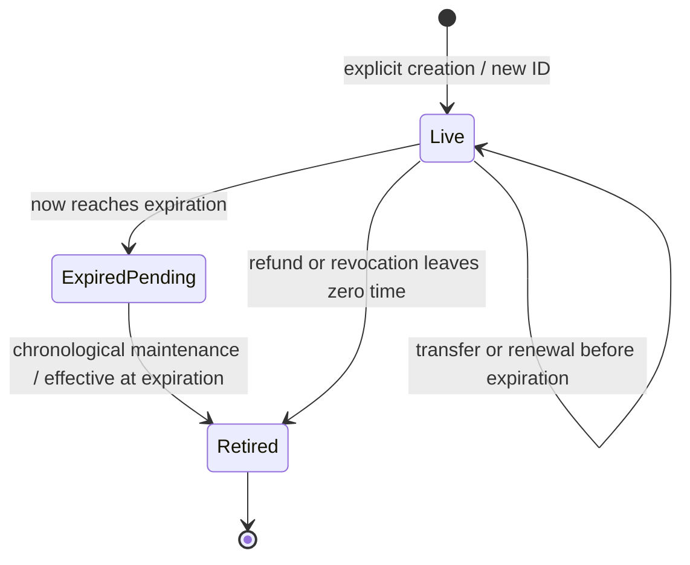

# Membership Lifecycle Data Model

## Position

Identity is `(chainId, tierAddress, tokenId)`; `totalMinted` increases only on creation and IDs are never reused. Ownership is exclusively the ERC-721 owner mapping, with OpenZeppelin owner enumeration maintained by mint, transfer and burn.

| State | Fields / semantics |
|---|---|
| Membership | Existing checkpoint, remaining paid seconds, remaining grant seconds, occupied flag; absolute expiration is their checked sum |
| Rewards | Existing shares, index, `creditScaled`, eligibility, keyed by token ID |
| Referral | Existing Unset / LockedNone / LockedAddress and referrer, keyed by token ID |
| Funding | Existing generation, head, active lot and historical lots; payment provenance remains historical payer data |
| Expiration | Exactly one indexed expiry node for each extant occupied token, including zero shares |
| Ownership | ERC-721 owner, approval and enumeration; no wallet-to-single-token association |

Payment provenance is not ownership authority. Transfer requires no checkpoint catch-up, even with overdue funding or retirement work, and changes only ERC-721 ownership/approval/enumeration and associated product reads; it does not reset index, settle credit to the sender, move lots between IDs, change time, or issue shares.

## Lifecycle

Returning creates a separate Live entity. There is no transition from Retired or ExpiredPending back to Live. ExpiredPending may still have an ERC-721 owner until maintenance, but cannot provide access, transfer, renew, or receive more time. The owner at delayed burn is necessarily the owner at expiration because transfers are forbidden at/after that boundary.

On retirement: settle financial credit through the effective boundary; move exact token credit into retired owner credit; zero shares, eligibility and token reward credit; remove expiry entry; clear live membership and referral association; burn through the internal authorized ERC-721 path; decrement occupancy exactly once. Retain funding history and retirement event evidence. Store no ownership fallback that can resurrect a token. Historical funding views accept issued IDs; live ownership/metadata/subscription views reject burned IDs. `isActiveToken` returns false for issued retired IDs and invalid/unissued IDs must not be confused with valid historical membership evidence.

## Expiration schedule and coordinator

`ExpirationNode { uint64 timestamp; uint256 tokenId; }`, a min-heap plus one-based `positionByToken`. An internal small expiration-schedule module owns insert/update/remove/peek, following the existing indexed funding-heap pattern. Every mutation adjusts at most the affected token's node in O(log N). No stale nodes accumulate from renewals.

Funding nodes remain in `VestingLedger.State`. The tier advances funding to `min(now, earliestExpiry)` and spends the remaining shared step budget retiring expiry roots only after funding through that timestamp is complete. The actual global cursor cannot move past pending work in either heap. An expiration of T is not complete merely because `accountedThrough == T`.

Status includes `accountedThrough`, `nextBoundary` (zero if none), funding-node count, expiration-node count, next kind (Funding / Expiration / None), and `complete`. Counts are O(1) heap sizes, not counts of all future lots. `complete` means both queues have no work due at/before requested as-of and continuous funding is accrued to as-of. A maintenance result also reports processed steps, retired count and newly earned scaled amounts. The next call uses persisted roots and timestamp, never a user-supplied cursor.

## Retired reward balance

`mapping(address => uint256) retiredCreditScaled`, within the tier's existing ledger. Its asset is the tier's immutable payment token. It confers no membership access, shares, renewal rights or referral choice.

For scale Q = 2^128 and settled token credit C:

- Retirement adds C to the owner's balance and zeros the token's credit. Aggregate earned member liability is unchanged.
- Claim pays `balance / Q` raw units and retains `balance % Q`; aggregate member liability and actual reserves decrease by precisely the amount paid times Q.
- Several retired positions add before rounding. A later NFT creation neither consumes nor inherits retired credit.
- Unallocated global reward carry goes to distribution dust on a denominator change using existing policy. It is distinct from settled member fractional credit.
- The last eligible position's retirement removes its weight without assigning previously unassigned funding or dust to that owner.

## Discovery and claim values

`PositionPage` contains bounded token IDs, next offset, current enumerable balance and page completion. A page lists current extant NFTs, including expired-awaiting-maintenance; timestamp-based position status distinguishes them. Consumers pin every page and position detail to one block. Burn/transfer changes owner order, so refresh starts from offset zero at a new snapshot. No claim or payment uses an offset as identity.

`TierClaimRequest` contains tier and selected token IDs. A tier appears once per transaction. The request lists bound selected work; a caller-supplied aggregate accounting budget bounds checkpoint work. No numeric batch ceiling is enforced. Empty IDs are allowed for creator/referral/retired-owner-only claims. Tier results contain processed steps and separate live reward, retired reward, referral and creator amounts. A factory result must not imply all account positions were selected.

Position selection is checked against the beneficiary before catch-up, then rechecked after catch-up. A selected expired token retired by that same call contributes via the beneficiary's retired balance. A token already burned before the call or transferred away causes a visible stale-selection failure; the UI refetches. Duplicate IDs are invalid. A direct retired-credit claim has no position dependency and can pay already-settled credit without global catch-up.

## Invariants

1. Each extant occupied NFT has exactly one matching expiration entry; burned IDs have none.
2. Occupied supply equals extant positions after committed maintenance, including pending expired NFTs until processed; capacity-sensitive mutation first completes catch-up.
3. No successful transfer/time extension targets `expiration <= now`.
4. Aggregate eligible weight equals the sum of eligible unretired positions at the accounting cursor; at complete catch-up it excludes all wall-clock-expired positions.
5. Each retirement removes shares once and never decreases lifetime gross.
6. Member liability includes live credit/index entitlements and retired-owner credit exactly once. Conservation includes separate existing unearned, cancellation, carry, dust and unassigned buckets.
7. Ownership enumeration and ERC-721 balance agree after mint, self-transfer, transfer, burn, callback success and callback revert.
8. Preview results match writes at the same timestamp and work budget, including partial equal-timestamp phases.

Financial settlement uses stored historical eligibility until the coordinator reaches expiration; the public wall-clock eligibility getter cannot be used to discard an expired position's still-unsettled index delta. Per-tier batch previews simulate shared accounting once and include owner-level balances once across all selected positions.

## 2026-09-12 clone and caller-budget amendment

Feature 005 remains open. One fixed implementation is deployed separately; the membership factory directly deploys standard deterministic ERC-1167 clones and initializes each atomically once. The implementation is initialization-locked. Initializable OpenZeppelin ERC-721 enumeration/ownership preserve independent tier state; fixed economic storage has no setters or upgrade path. Factory registration distinguishes official tiers. Tier A/B stores and the separate tier deployer are removed.

Custom membership mutations accept an explicit accounting budget; factory claims share a caller budget across sorted tier requests by actual consumed steps. All protocol batch/page paths remove arbitrary numeric iteration ceilings. Inputs, economics and native Robinhood limits remain validated. Positive-budget maintenance saves chronological partial progress; atomic mutations revert if catch-up cannot finish. Standard ERC-5643 signatures require separate maintenance for due events. Transfer and settled retired-credit withdrawal do not run catch-up.

Validation includes above-former-cap cases, small/large batch equivalence, locked/atomic clone initialization, independent storage, Claim all interruption/revalidation, and measured before/after gas. Replace only the owned fork/web at RPC 18557, chain 31337 and web 3110 using the existing private RPC/pin. Explorer verification/clone recognition is deferred to the next authorized testnet deployment. Previous evidence does not validate this amendment.
