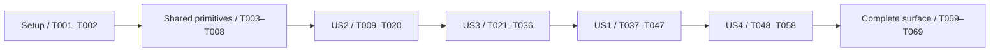

# Tasks: Transferable Memberships and Permanent Retirement

**Current status (2026-09-12)**: Feature 005 is open and has not been accepted as validated. T001–T071 record work on the earlier implementation; their checked state does not close the amended scope. Phase 9 is required before a new validation/convergence verdict. Preserve prior test/deployment evidence and reviewer-owned checklist markers.

**Input**: [spec.md](spec.md), [plan.md](plan.md), [research.md](research.md), [data-model.md](data-model.md), [tier-api.md](contracts/tier-api.md), [application-flows.md](contracts/application-flows.md), [quickstart.md](quickstart.md).

**Tests**: Required by FR-016 and SC-001–SC-007. Write the focused tests before the associated implementation, observe the expected failure, then make them pass. Zero matched tests is not evidence. No implementation task is completed by generating this document.

**Confirmed behavior**: Live transfers work during pauses and never run or require checkpoint catch-up, regardless of pending maintenance; refunds/cancellation are creator-only and pay the current NFT owner; NFT approvals authorize transfer only. Explicit sponsorship remains independent of NFT approval. All affected UI implementation tasks must satisfy the accessibility criteria in `specs/005-transferable-memberships/contracts/application-flows.md`. Static analysis and source review are accepted for accessibility verification when automated/interactive checks are unavailable, with explicit limitations. Membership selection, discovery, maintenance and reward UI tasks must also implement the loading/empty/failed/stale/incomplete state table in that application contract, including scoped partial totals and action-specific availability. All other scope and acceptance details come from the linked artifacts.

**Paths**: Repository-relative to `/Users/user/Development/backed-by-fans`. Named files that do not yet exist are explicitly created by their tasks. Evidence files below are new, feature-local outputs. Preserve historical specs/evidence and unrelated dirty work.

**Format**: `- [ ] Tnnn [P?] [USn?] Action with exact file paths`. `[P]` indicates disjoint files within the named phase's test/document group, after that phase's prerequisites; it does not authorize concurrent editing of shared files or starting before dependencies. All unmarked implementation tasks run in listed order.

**Ordering**: US1, US2 and US3 are all P1. Execute US2 → US3 → US1 to establish the lifecycle and explicit position identity before transfer/retirement integration tests. Transfer execution itself does not depend on checkpoint catch-up. US4 (P2) completes portfolio discovery and claims. This is an implementation dependency order, not a change to story priorities. Shared identity/ABI changes are one local integration unit; do not add compatibility adapters or publish intermediate stages.

Each ABI-changing task includes the mechanical updates needed to keep its currently existing source/test callers compiling, as inventoried in T002; later tasks add their named behavior and acceptance rather than defer basic compile fixes. In particular, migrate existing calls in `web/src/features/membership/account-discovery.ts` and `web/src/features/membership/account-rewards-read.ts` when the wallet-based ABI is removed in US3, then complete their pagination/aggregation semantics in US4. Do not add temporary default-token wrappers, silent truncation or stub implementations to bridge phases.

## Phase 1: Setup and implementation gates

**Purpose**: Finish the pre-implementation review and establish an exact baseline in the existing project, without scaffolding a new application or replacing dependencies.

- [X] T001 Confirm the backfilled requirements-quality review in `specs/005-transferable-memberships/checklists/requirements.md`, then run `$speckit-analyze` over `specs/005-transferable-memberships/spec.md`, `specs/005-transferable-memberships/plan.md` and this task list; record results in `specs/005-transferable-memberships/analysis.md` and resolve blocking contradictions before code changes.
- [X] T002 Inspect checkout changes, `contracts/foundry.toml`, `web/package.json`, `web/AGENTS.md`, installed Next guides under `web/node_modules/next/dist/docs/`, and `contracts/scripts/build-linked-protocol.sh`; record versions, targeted baseline test results, current call-site inventory and available local/fork prerequisites in `specs/005-transferable-memberships/evidence/baseline.md`, preserving dirty work and exposing missing prerequisites without reading or recording secrets.

**Checkpoint**: Task analysis passes and the existing toolchain/transaction boundaries are understood. Creating this task list does not claim T001 or T002 is complete.

## Phase 2: Foundational accounting and schedule primitives

**Purpose**: Provide shared, independently testable primitives before changing public membership behavior. Types may be introduced here; public endpoints and obsolete signatures are replaced with their implementations in the owning story phases, without stub endpoints.

- [X] T003 Define expiration, maintenance status/result, position page, retired-credit, selected-tier claim and preview result types in `contracts/src/types/MembershipTypes.sol` from `specs/005-transferable-memberships/contracts/tier-api.md`; distinguish stored versus projected state and separate live/retired/referral/creator payouts.
- [X] T004 [P] Create `contracts/test/ExpirationSchedule.t.sol` covering indexed insert/update/remove, equal-time token-ID order, earlier/later rescheduling, absent nodes and no accumulation of stale nodes across repeated renewals.
- [X] T005 [P] Extend the independent model in `contracts/test/models/MembershipModel.sol` for token-scoped positions, historical expiration, owner changes, retired scaled credit and monotonic gross; define conservation independently of production heap/ledger helpers.
- [X] T006 Implement `contracts/src/libraries/ExpirationSchedule.sol` with one node per extant position, `(expiration, tokenId)` ordering and indexed O(log N) mutation; pass `contracts/test/ExpirationSchedule.t.sol` without historical-token scans.
- [X] T007 Add primitive red/green coverage in `contracts/test/VestingLedger.t.sol` and `contracts/test/mocks/VestingLedgerHarness.sol`, then extend `contracts/src/libraries/VestingLedger.sol` to advance funding to a caller-specified historical boundary, flush earned allocations before weight changes, permanently remove weight, move exact credit into `retiredCreditScaled`, and debit retired payouts without duplicating aggregate liabilities or rewinding gross.
- [X] T008 Adapt `contracts/test/helpers/LinkedVestingFixture.sol`, `contracts/test/helpers/VestingFixtures.sol` and `contracts/test/mocks/MembershipTierHarness.sol` to the shared types/primitives; run the linked build and foundation suites, recording exact counts and outcomes in `specs/005-transferable-memberships/evidence/foundation.md`.

**Checkpoint**: Heap and financial primitives are tested; stored historical eligibility, individual credit and global carry/dust remain distinct. No transfer or expired-ID revival shortcut has been introduced.

## Phase 3: US2 — Retire at the correct boundary without losing rewards (P1)

**Goal**: Any wallet can retire overdue positions chronologically in bounded batches and former owners can claim preserved rewards without an NFT.

**Independent test**: Replay a funding history with punctual maintenance, delayed maintenance and budgets 1–25. Compare exact scaled liabilities, burned ownership, removed weight and released capacity; claim accumulated retired fractions with zero NFTs. Until US3 permits multiple live IDs per wallet, same-owner fractional accumulation can use successive distinct memberships.

### Tests

- [X] T009 [P] [US2] Create `contracts/test/MembershipRetirement.t.sol` covering expiry-boundary burn, zeroed weight/association, one-time capacity release, historical funding reads, last eligible member, complimentary/zero-contribution expiry, owner credit aggregation, no payout callback during maintenance and no remint of retired IDs.
- [X] T010 [P] [US2] Extend `contracts/test/VestingScheduler.t.sol` and `contracts/test/VestingHistoryReplay.t.sol` for funding START/END tails and multiple expirations at one timestamp, every batch split, final-step completion, partial-progress persistence, atomic rollback and exact punctual/delayed equivalence.
- [X] T011 [P] [US2] Create `contracts/test/MembershipAccountingPreview.t.sol` for variable-denominator preview/write parity at identical timestamps and budgets, including historical stored eligibility, carry-to-dust transitions, target retirement, incomplete equal-time phases and bounded traversal.

### Implementation and integration

- [X] T012 [US2] Implement the shared chronological coordinator and `processAccounting`/`processExpirations` in `contracts/src/MembershipTier.sol` with matching declarations/events in `contracts/src/interfaces/IMembershipTier.sol`; spend at most 25 combined funding/retirement steps, finish funding at T before expiry at T, persist roots/cursor on incomplete success, and report complete when the last allowed step finishes all due work.
- [X] T013 [US2] Implement permanent retirement in `contracts/src/MembershipTier.sol`: settle via stored ledger eligibility, capture owner, preserve credit, zero weight/eligibility, remove expiry/live/referral association, allow the internal burn, release occupancy once and emit historical effective time; remove `synchronizeExpiredMemberships` and suspension/restoration behavior, replacing `contracts/test/ExpiredMembershipSync.t.sol` with relevant retirement coverage rather than leaving obsolete assertions.
- [X] T014 [US2] Route every current purchase, renewal, gift, contribution including zero, grant, revocation and refund through shared catch-up/schedule mutation in `contracts/src/MembershipTier.sol`; normalize elapsed time without moving absolute expiration, shorten on partial revocation, cancel funding and retire immediately on zero-time cancellation, and revalidate target ownership after catch-up.
- [X] T015 [US2] Implement `claimRetiredRewards`, `claimableRetiredReward`, retired-credit `hasClaimInterest`, and owner-authorized single-token claims that handle retirement during that call in `contracts/src/MembershipTier.sol`, `contracts/src/interfaces/IMembershipTier.sol` and `contracts/src/libraries/VestingLedger.sol`; retain fractional remainders, allow settled retired claims while paused/behind, and reject already-burned token selections without requiring a new NFT.
- [X] T016 [US2] Replace fixed-denominator accounting/refund projections in `contracts/src/libraries/VestingLedger.sol` and tier preview/status integration in `contracts/src/MembershipTier.sol`; use bounded overlays of touched schedule/account nodes, simulate both queues and historical eligibility, expose raw/fractional retired credit and accurate completeness, and retain issued-ID funding history while burned live views reject.
- [X] T017 [US2] Generate the updated bindings in `web/src/contracts.ts` using `web/wagmi.config.ts` and `bun run generate`; update status/preview shapes in `web/src/contracts/types.ts`, `web/src/features/membership/VestingSummary.tsx` and affected existing callers to distinguish accounting-cursor state, wall-clock expiry and projected balances without handwritten ABI or address fallbacks.
- [X] T018 [US2] Write `web/src/features/membership/MembershipMaintenance.test.tsx`, `web/src/features/membership/RetiredRewardClaim.test.tsx` and `web/tests/e2e/membership-retirement.spec.ts` for arbitrary-wallet/paused maintenance, committed partial progress, zero-NFT fractional credit display/claim, incomplete accounting and library-supplied receipt reconciliation.
- [X] T019 [US2] Create reusable `web/src/features/membership/MembershipMaintenance.tsx` and `web/src/features/membership/RetiredRewardClaim.tsx`, integrate them in `web/src/features/membership/MembershipExperience.tsx` and `web/src/features/creator/TierManagement.tsx`, and remove `web/src/features/creator/expired-membership-sync.ts`, `web/src/features/creator/ExpiredMembershipSyncControl.tsx` and their obsolete tests; expose progress without scanning `totalMinted`, privileged gating or automatic subsequent payment.
- [X] T020 [US2] Run US2 contract/model, component and configured local browser acceptance from `specs/005-transferable-memberships/quickstart.md`; record matched tests, exact accounting comparisons and browser proof or unavailable prerequisites in `specs/005-transferable-memberships/evidence/us2-retirement.md`, resolving failures before advancing.

**Checkpoint**: Expiry is financially effective at its timestamp, even when cleanup is late. Maintenance and preserved-credit claims work while paused; no bounded batch requires processing all simultaneous events in one transaction.

## Phase 4: US3 — Renew deliberately or start fresh (P1)

**Goal**: Replace wallet-selected identity everywhere with explicit creation and selected-token extension, allow multiple positions and issue fresh identity/weight after retirement.

**Independent test**: Create A and B for one wallet, renew A without changing B, expire A, then create C. C has a new ID/fresh referral state and only current-curve issuance; old credit remains separate and gross never decreases. Exercise fixed-price, contribution, gift and grant paths.

**Shared prerequisite owned here**: Removing `tokenOf` also requires replacing the single-token tier/factory claim ABI. Its bounded contract implementation belongs in this phase so the identity change compiles without an interim compatibility API; US4 adds portfolio UI and cross-position acceptance on top.

### Tests

- [X] T021 [P] [US3] Replace persistent-credential assumptions in `contracts/test/MembershipIdentity.t.sol` with multiple same-tier IDs, explicit new-versus-renew, exact-expiry rejection, lifetime gross, fresh referral/weight and 100-item owner-page bounds; cover zero/nonzero contributions and max-prepayment/overflow/minimum-payment boundaries.
- [X] T022 [P] [US3] Extend `contracts/test/GrantsAndCapacity.t.sol`, `contracts/test/RefundsAndOwnership.t.sol` and `contracts/test/CapacityAndPause.t.sol` for explicit gifted/granted IDs, expected-owner/referral mismatches, paid-plus-grant scheduling, partial revocation, creator-only refunds, exact payout failure rollback, released capacity and unchanged lifetime gross.
- [X] T023 [P] [US3] Extend `contracts/test/ClaimEverything.t.sol` and `contracts/test/ClaimsAndWithdrawals.t.sol` for explicit selections, duplicate/invalid IDs and tiers, 32 aggregate IDs/8 tiers/25 shared steps, empty-ID beneficiary claims, retirement during claim, creator/referral/retired categories counted once and atomic factory failure.

### Implementation and integration

- [X] T024 [US3] Replace wallet-to-single-token storage and remint helpers with monotonic new-ID creation and current-owner indexing through installed OpenZeppelin `ERC721Enumerable` in `contracts/src/MembershipTier.sol`; implement `tokensOfOwner` pages capped at 100 and timestamp-based token access/status, and remove `tokenOf`, wallet `isActive` and `activeBalanceOf` from `contracts/src/interfaces/IMembershipTier.sol` and internal callers as part of the following coherent API replacement.
- [X] T025 [US3] Implement `createMembership`, `renewMembership`, `createContributionMembership` and `renewContributionMembership` in `contracts/src/MembershipTier.sol` and `contracts/src/interfaces/IMembershipTier.sol`, replacing implicit purchase/contribution entry points; validate an extant target's expiry before catch-up, revalidate ownership afterward, preserve live position/referral history, use current gross for new issuance and schedule zero-contribution positions identically.
- [X] T026 [US3] Implement explicit `giftMembership`, `giftRenewal`, `grantMembership`, `addGrantTime`, expected-owner revocation and expected-owner/ceiling refund APIs in `contracts/src/MembershipTier.sol` and `contracts/src/interfaces/IMembershipTier.sol`; preserve Unset gifted referrals, locked sponsorship choices and creator authorization, finalize retirement before refund transfer, and initialize complete state before safe mint callbacks.
- [X] T027 [US3] Update `renewSubscription`, `cancelSubscription`, `isRenewable` and expiry views in `contracts/src/MembershipTier.sol` with the existing ERC-5643 contract in `contracts/src/interfaces/IERC5643.sol`; preserve token-ID targeting, native-value/pricing/referral restrictions, creator-only cancellation and false renewability at expiry, without silently creating a replacement ID.
- [X] T028 [US3] Replace tier `claimAll`/`claimAllFor` with `claimRewards`/factory-only `claimRewardsFor` in `contracts/src/MembershipTier.sol`, `contracts/src/interfaces/IMembershipTier.sol` and `contracts/src/libraries/VestingLedger.sol`; prevalidate unique selected ownership, track selected IDs retired by this call, pay beneficiary categories once, enforce 32 IDs and 0–25 internal accounting steps, and preserve direct retired claims independently of selection.
- [X] T029 [US3] Replace factory `claimEverything(address[])` with selected tier requests in `contracts/src/MembershipFactory.sol` and `contracts/src/interfaces/IMembershipFactory.sol`; enforce 8 unique registered tiers, 32 total IDs and 25 actual combined accounting steps, preserve `AccountingBehind` decoding and atomic failure, and pass the tests in `contracts/test/ClaimEverything.t.sol`.
- [X] T030 [US3] Regenerate `web/src/contracts.ts` and update removed ABI callers in `web/scripts/seed-buyback-demo.ts`, `web/scripts/protocol-fork-fixture.ts`, `contracts/test/helpers/VestingFixtures.sol` and affected E2E setup helpers; obtain created IDs from supplied successful receipt events, never wallet lookup or historical-log reconstruction, and keep ephemeral broadcasts out of public deployment records.
- [X] T031 [US3] Update position/intent types and reads in `web/src/contracts/types.ts`, `web/src/features/membership/membership-read.ts`, `web/src/features/membership/state.ts` and `web/src/features/protocol/preview-funding.ts` for explicit new/renew/gift/grant selection, chain/tier/token keys, owner-pinned quotes, bounded owner pages and fresh-return economics; update their adjacent tests before the implementations.
- [X] T032 [US3] Write new-versus-renew and selected gift/grant/refund behavior tests in `web/src/features/membership/MembershipExperience.test.tsx`, `web/src/features/creator/management.test.ts` and `web/tests/e2e/join-renew-gift.spec.ts`; cover multiple positions, stale expected owner/referral, ended-position creation and zero-contribution/grant maintenance requirements.
- [X] T033 [US3] Update `web/src/features/membership/MembershipExperience.tsx` for explicit **New membership**, **Renew membership #ID**, new gift and selected-ID sponsorship, independent position previews and ended-membership return; remove restoration promises and use native wagmi simulation/write/receipt states without automatic payment after maintenance.
- [X] T034 [US3] Update `web/src/features/creator/TierManagement.tsx`, `web/src/features/creator/management.ts` and `web/src/features/creator/management-read.ts` for explicit new/selected grants, revocations and creator-only refund confirmations with recipient/ceiling; preserve existing tier creator authority and eliminate recipient-wallet token inference.
- [X] T035 [US3] Update `web/src/features/protocol/grant-reconciliation.ts`, `web/src/features/protocol/write-reconciliation.ts` and their adjacent tests to decode new IDs from the successful supplied receipt and reread explicit-ID owner/time postconditions; invalidate affected position/owner reads without custom receipt polling, replacement logic or durable intent storage.
- [X] T036 [US3] Run US3 identity, funding, grant/refund, batch-contract and web acceptance plus `web/tests/e2e/join-renew-gift.spec.ts` and `web/tests/e2e/creator-operations.spec.ts` in the configured local fixture; record fresh-ID/current-curve and unaffected-sibling proof in `specs/005-transferable-memberships/evidence/us3-fresh-positions.md` and resolve regressions in changed callers.

**Checkpoint**: Creation and renewal are explicit, no wallet-selected default remains, old IDs cannot revive, and all existing financial entry points compile against the new position model. Creator/claim contract APIs are migrated without compatibility wrappers.

## Phase 5: US1 — Transfer a complete live membership (P1)

**Goal**: Transfer a selected live position, including into an already-member wallet, while preserving all token economics and applying the confirmed permission rules.

**Independent test**: Give A two distinct positions and B another; accrue rewards and transfer one A→B, including during a pause. Compare time, shares, eligibility, reward credit, lots and locked referral; demonstrate current-owner rights, creator-only refund to B and rejection of expired transfers and operator owner-only actions.

### Tests

- [X] T037 [P] [US1] Create `contracts/test/TransferableMemberships.t.sol` for owner/approved/operator/self transfers, both safe overloads, existing-member recipient, field conservation and unchanged schedules/cursor with zero checkpoints processed despite more than 25 due funding/expiry steps, exact-expiry rejection, paused transfer, stale token-approval reset and a transferred referral address equal to the new owner without relocking.
- [X] T038 [P] [US1] Create `contracts/test/mocks/MembershipReceiver.sol` and `contracts/test/MembershipReceiver.t.sol` covering safe receiver acceptance/rejection and attempted callback claim, renewal, retransfer and maintenance; prove complete state/atomic rollback and no nested-guard failure on valid transfer or mint.
- [X] T039 [P] [US1] Extend `contracts/test/RefundsAndOwnership.t.sol` and `contracts/test/ClaimsAndWithdrawals.t.sol` with actual post-transfer owner/beneficiary checks, former-owner rejection, token/operator approval denied owner-only renewal/claim even when payout targets owner, and sponsorship/refund previews made stale by transfer.

### Implementation and integration

- [X] T040 [US1] Restore OpenZeppelin ERC-721 approvals and implement one guarded live-transfer path covering `transferFrom` and both safe variants in `contracts/src/MembershipTier.sol`; allow paused live transfers regardless of accounting backlog, check ERC-721 authority and `now < expiration` directly without invoking catch-up or requiring complete maintenance, keep the guard through receiver callbacks, clear token approvals normally and leave position economics/schedule untouched by ownership movement.
- [X] T041 [US1] Remove `Soulbound`, `locked`, Locked events and ERC-5192 inheritance/support from `contracts/src/MembershipTier.sol` and `contracts/src/interfaces/IMembershipTier.sol`, removing the unused `contracts/src/interfaces/IERC5192.sol`; audit owner checks to keep NFT approvals transfer-only and truthful ERC-721/enumeration/metadata/ERC-5643/ERC-4906 support, with no public arbitrary burn.
- [X] T042 [US1] Regenerate `web/src/contracts.ts` and update `web/src/lib/membership-interfaces.ts` plus authenticity tests to require the new truthful interface set and official chain/factory registration, without accepting ERC-5192 as a prerequisite or treating old immutable deployments as the new protocol.
- [X] T043 [US1] Write `web/src/features/membership/TransferMembership.test.tsx` and `web/tests/e2e/membership-transfer.spec.ts` for selected-ID confirmation, recipient ownership change, NFT approval/revocation distinct from ERC-20 allowance, paused availability with a backlog exceeding 25 steps and incomplete reward projections, no maintenance gate or prompt for live transfers, expired refusal and real library error/receipt states.
- [X] T044 [US1] Create `web/src/features/membership/TransferMembership.tsx` and integrate it into `web/src/features/membership/MembershipExperience.tsx`; expose safe transfer and standard approval management without gating on accounting completeness or adding maintenance prerequisites, explain transferred time/benefits/unclaimed rewards and locked referral, and grant no claim/renew UI authority based solely on NFT approval.
- [X] T045 [US1] Add transfer receipt/postcondition handling to `web/src/features/protocol/write-reconciliation.ts` and its adjacent tests; reread selected-token ownership/access and invalidate both wallets' ownership/reward queries after library receipt success, preserving canonical outcomes if subsequent ownership changed.
- [X] T046 [US1] Extend `web/tests/e2e/membership-transfer.spec.ts` and `web/tests/e2e/claims-refunds.spec.ts` to prove A→B movement with multiple positions, transfer while paused with more than 25 pending checkpoint steps and no maintenance prerequisite, former-owner denial, transfer-only approvals and creator refund paying B; use direct contract rereads for both wallets before US4 completes portfolio presentation.
- [X] T047 [US1] Run US1 transfer/receiver/authority suites and browser acceptance, then replay retirement of a transferred NFT and verify preserved credit belongs to its final owner; record outcomes in `specs/005-transferable-memberships/evidence/us1-transfers.md` and resolve failures.

**Checkpoint**: All P1 contract behaviors and a direct membership-page transfer/retirement/claim journey are demonstrated locally. Full account discovery and claims remain required in US4 before feature completion.

## Phase 6: US4 — Manage every membership and reward balance (P2)

**Goal**: Discover, select, preview and claim across bounded multi-position pages without losing ended-membership balances or double-counting tier categories.

**Independent test**: Use at least 101 positions in one tier and 9 tiers; page at a pinned block, change ownership before submission, claim across multiple 32-ID/8-tier transactions, then claim from a zero-NFT wallet. Verify completeness indicators and exact tier-category totals.

### Tests

- [X] T048 [US4] Extend `contracts/test/ClaimEverything.t.sol` and `contracts/test/MembershipAccountingPreview.t.sol` for 101-position/9-tier histories, batch preview parity, transfers/burns after selection, same-call retirement, beneficiary-only tiers, no repeated owner-category credits and actual aggregate 25-step enforcement including expiration work.
- [X] T049 [US4] Implement `previewClaimRewards` in `contracts/src/MembershipTier.sol`, `contracts/src/interfaces/IMembershipTier.sol` and `contracts/src/libraries/VestingLedger.sol`; simulate a tier once for at most 32 unique IDs and 256 view steps, return per-position plus single beneficiary-category results, and keep transaction-feasibility previews within the shared 25-step budget; regenerate `web/src/contracts.ts`.
- [X] T050 [P] [US4] Extend `web/src/features/membership/account-discovery.test.ts`, `web/src/features/membership/account-cache.test.ts` and `web/src/features/membership/AccountDiscovery.test.tsx` for same-tier key collisions, block-pinned owner pages, burn/transfer reorder refresh, partial totals, fractional-credit-only discovery and zero NFT access false positives.
- [X] T051 [P] [US4] Extend `web/src/features/membership/account-rewards-read.test.ts` and `web/src/features/membership/AccountRewards.test.tsx` for selected-position batches, unique tier accounting work, ended-credit categories counted once, incomplete projection, duplicate/stale selection and receipt-led reconciliation.

### Implementation and integration

- [X] T052 [US4] Replace singular account discovery/cache records in `web/src/features/membership/account-discovery.ts` and `web/src/features/membership/account-cache.ts` with nested bounded tier/owner pages, chain/tier/token identity and chain/tier/beneficiary credit records; pin each snapshot's reads to one block and restart owner pagination after refresh rather than continuing reordered offsets.
- [X] T053 [US4] Update `web/src/features/membership/account-rewards-read.ts` and `web/src/contracts/types.ts` to preview each selected tier once, include live/retired/referral/creator amounts once, distinguish settled/projected fractions and completeness, and allocate the same aggregate accounting budget as the proposed transaction.
- [X] T054 [US4] Update `web/src/features/membership/AccountDiscovery.tsx` with separate same-tier positions, clear expired-pending/retired states, more-results controls, honest partial totals and ended-membership reward discovery when no NFT remains; keep wallet access derived from live owned token proof rather than `balanceOf`.
- [X] T055 [US4] Update `web/src/features/membership/AccountRewards.tsx` to select bounded positions/tiers, label **Claim selected rewards**, include beneficiary categories once per tier, reuse `web/src/features/membership/RetiredRewardClaim.tsx` for direct settled credit, and refetch stale ownership selections instead of silently skipping them.
- [X] T056 [US4] Update `web/src/features/protocol/payout-reconciliation.ts` and its adjacent tests for distinct live/retired/referral/creator result fields and selected-ID factory receipts, invalidating affected position and beneficiary queries only after a successful wagmi/viem receipt; preserve error reporting for atomic batch rollback.
- [X] T057 [US4] Extend `web/tests/e2e/supporter-account.spec.ts` and `web/tests/e2e/accounting-preview.spec.ts` for multiple pages/batches, mid-selection transfer/burn, claimable ended credit with zero NFTs, single-count tier previews and desktop/narrow-screen loading/empty/error/partial states.
- [X] T058 [US4] Run the US4 contract, cache/read/component and configured browser scenarios; record complete 101-position/9-tier discovery/claims, exact payout totals and stale-selection behavior in `specs/005-transferable-memberships/evidence/us4-portfolios.md`, resolving omissions and double-counting before final verification.

**Checkpoint**: Every position and retired balance is discoverable and claimable through bounded calls; incomplete pages or projections are visible, and no same-tier identity is overwritten.

## Phase 7: Documentation, full verification and convergence

**Purpose**: Complete the requested product surface and verify the combined lifecycle on the final code. These tasks are required, not optional polish.

- [X] T059 [P] Rewrite current lifecycle integration documentation in `docs/protocol/integration.md` against final interfaces: explicit position identity, transfer-only approvals, live transfers without checkpoint catch-up including while paused, creator refunds/current-owner payouts, chronology, retired fractional credits, owner pages, batch limits, and historical-versus-live views; preserve historical feature evidence.
- [X] T060 [P] Update `docs/whitepaper/whitepaper.md` and `docs/whitepaper/outline.md` for independent transferable positions whose live transfers require no checkpoint catch-up, permanent expiration weight removal, fresh return issuance and separately claimable earned rewards; eliminate soulbound/same-ID reissue/suspend-restore promises and avoid implying the holder personally paid.
- [X] T061 Update `docs/whitepaper/build_diagrams.py`, `docs/whitepaper/assets/membership-timeline.svg` and `docs/whitepaper/assets/reward-weight.svg`; run `web/scripts/build-whitepaper.ts` through `bun run whitepaper:build` to regenerate `web/public/backed-by-fans-whitepaper.pdf`, visually inspect changed diagrams/pages and record evidence in `specs/005-transferable-memberships/evidence/whitepaper.md`.
- [X] T062 Complete lifecycle parity in `web/src/features/protocol/preview-funding.ts`, `web/scripts/seed-buyback-demo.ts` and `web/scripts/protocol-fork-fixture.ts`; audit remaining simulation/deployment/test callers identified in `specs/005-transferable-memberships/evidence/baseline.md` and replace old selectors/identity assumptions without new RPC services, parallel bindings or public broadcast.
- [X] T063 Extend handlers and end-to-end model comparisons in `contracts/test/invariants/MembershipInvariant.t.sol`, `contracts/test/models/MembershipModel.sol` and `contracts/test/VestingHistoryReplay.t.sol` for arbitrary creation/renewal/transfer/funding/retirement/refund/claim interleavings, exactly one expiry entry per extant position, gross monotonicity and full scaled cash conservation; run the pinned fuzz/invariant settings and record results in `specs/005-transferable-memberships/evidence/invariants.md`.
- [X] T064 Create `contracts/test/MembershipLifecycleGas.t.sol` to benchmark at least 10,000 scheduled positions, equal-time backlogs and maximum claim/preview/page shapes; record queue work, gas and bounded overlay reads in `specs/005-transferable-memberships/evidence/gas.md`, fixing unbounded traversal and asserting no more than 25 mutation events, 100 owner-page items or 256 preview events per call.
- [X] T065 Verify the final linked tier/library build via `contracts/scripts/build-linked-protocol.sh`, `contracts/test/deployment/VestingLinking.t.sol` and the existing local deployment rehearsal using `contracts/script/LinkedVestingDeployment.sol`; record bytecode/runtime sizes and intended-profile gas under the configured 98,304-byte/100,000,000-gas ceilings in `specs/005-transferable-memberships/evidence/deployability.md`, separately from test-harness overrides and without public-chain writes.
- [X] T066 Review final authorization, reentrancy, historical eligibility, carry/credit conservation and factory failure behavior in `contracts/src/MembershipTier.sol`, `contracts/src/libraries/VestingLedger.sol` and `contracts/src/MembershipFactory.sol`; run the pinned Slither configuration in `contracts/slither.config.json`, resolve actionable findings and record exact review scope/results in `specs/005-transferable-memberships/evidence/review.md` without implying a public audit or deployment.
- [X] T067 Run `scripts/verify-local.sh` and the implementation commands in `specs/005-transferable-memberships/quickstart.md`, including linked contract tests, `web/package.json` generation/format/lint/test/build/typecheck checks and configured browser integration; record exact commands/counts/outcomes and unavailable prerequisites in `specs/005-transferable-memberships/evidence/verification.md`, never substituting mocks for missing fork/browser proof.
- [X] T068 Finish combined acceptance through `web/tests/e2e/membership-retirement.spec.ts`, `web/tests/e2e/membership-transfer.spec.ts`, `web/tests/e2e/supporter-account.spec.ts` and `web/tests/e2e/creator-operations.spec.ts`; implement/review the application-contract accessibility criteria across position selectors, transfer/approval controls, maintenance progress and reward selections; run available static and interactive checks, accepting static analysis/source review when automation or browser/assistive-technology testing is unavailable and recording each untested behavior; verify the clarified permission rules using successful supplied receipts plus canonical reads, and record final commit-scoped evidence in `specs/005-transferable-memberships/evidence/browser.md` without rerunning unchanged passing suites absent a new concern.
- [X] T069 Run `$speckit-converge` against `specs/005-transferable-memberships/spec.md`, `specs/005-transferable-memberships/plan.md`, this task list and the evidence directory; check every FR/SC and obsolete active-code/copy reference, resolve remaining work, then record the final evidence-bounded verdict in `specs/005-transferable-memberships/convergence.md`. Do not infer commit, push, deployment or completion of unrun evidence classes.

## Dependencies and execution order

The order among P1 stories resolves their shared lifecycle dependency. US2 can be independently verified using ordinary funded/free positions; US3 verifies siblings and fresh returns on that kernel; US1 then verifies live movement and changed authority; US4 validates aggregate discovery/claims with actual transfers. None relies on unimplemented later behavior for its stated checkpoint. US3 owns the core batch-claim ABI because retaining single-wallet claim adapters would violate the identity change; US4 owns portfolio-facing aggregation and additional transfer-race coverage.

Within phases, follow listed order except these explicitly independent groups:

| Group | Prerequisites | Parallel tasks | Join before |
|---|---|---|---|
| Foundation tests/model | T003 | T004, T005 | T006–T008 |
| US2 contract tests | T008 | T009, T010, T011 | T012 |
| US3 contract tests | T020 | T021, T022, T023 | T024 |
| US1 contract tests | T036 | T037, T038, T039 | T040 |
| US4 web tests | T049 | T050, T051 | T052 |
| Current documentation | T058 | T059, T060 | T061 |

`MembershipTier.sol`, `VestingLedger.sol`, shared interfaces/types, `web/src/contracts.ts`, shared membership/account readers and E2E fixture configuration each have one writer at a time. Generated bindings run only after the corresponding contract implementation compiles. Marking test authoring parallel does not make test execution possible before the tested implementation exists; expected failures must be observed and subsequently resolved.

### Parallel examples per story

- **US2**: After T008, author `MembershipRetirement.t.sol` (T009), scheduler/history cases (T010), and preview cases (T011) in separate files, then integrate coordinator changes sequentially.
- **US3**: After T020, author identity tests (T021), time-mutation tests (T022), and batch-claim tests (T023) independently. Keep the subsequent tier/interface/factory migration sequential.
- **US1**: After T036, author ordinary transfer tests (T037), receiver tests (T038), and current-owner authority tests (T039) independently, then implement and integrate the guarded transfer path.
- **US4**: After T049, author discovery/cache tests (T050) and reward aggregation/UI tests (T051) independently, then implement their shared consumer types/read paths sequentially.

## Requirement traceability

| Requirement | Primary task coverage |
|---|---|
| FR-001 Transfers/approvals, including pause | T037–T044, T046–T047, T068 |
| FR-002 Whole position follows token | T024–T027, T037, T040, T047, T063 |
| FR-003 Current owner and creator-only refund | T015, T022, T026–T029, T034–T035, T039–T046 |
| FR-004 Exact expiry/stale bypass | T009–T016, T021, T025, T027, T037, T040 |
| FR-005 Chronological funding before expiry | T007, T010–T013, T016, T063 |
| FR-006 Permanent burn/zero weight/capacity | T009, T012–T014, T024–T027, T063 |
| FR-007 Fractional retired-owner rewards | T005, T007, T009, T013, T015–T020, T028, T048–T058 |
| FR-008 Live renewal versus fresh creation | T021, T024–T027, T031–T036 |
| FR-009 Lifetime gross never rewinds | T005, T007, T009, T021–T022, T025–T026, T063 |
| FR-010 Permissionless bounded maintenance | T006, T010, T012, T018–T020, T064 |
| FR-011 Every time operation schedules expiry | T014, T021–T022, T025–T027, T063 |
| FR-012 Accounting-dependent mutations catch up; transfer/settled-credit exceptions; atomic rollback honest | T010, T012, T014–T015, T019, T023, T028–T029, T037, T040, T043–T044, T051, T056 |
| FR-013 Multiple positions, no wallet inference | T021, T024–T036, T052–T058 |
| FR-014 Bounded discovery/claims | T021, T023–T024, T028–T029, T048–T058, T064 |
| FR-015 Exact/incomplete previews | T011, T016–T017, T031, T048–T049, T053, T057 |
| FR-016 Complete product/test/whitepaper surface | T017–T019, T030–T036, T042–T046, T050–T062, T067–T069 |
| FR-017 Existing immutable economics/liabilities | T005, T007, T010, T022, T025–T029, T063, T066 |

SC-001/004 are demonstrated by US1/US3; SC-002/003 by US2 plus final invariants; SC-005 by US4; SC-006 by all mutation/paused/browser checkpoints; SC-007 by T059–T069. The three accepted clarification answers are explicitly exercised in T022, T037, T039, T043, T046 and T068.

## Implementation strategy

The first useful increment is the tested retirement/owner-credit journey after US2. The suggested **MVP verification scope** is all three P1 stories (through T047): creation of independent positions, deliberate live renewal, transfer during a pause, permanent expiration and claim after burn. US1 alone cannot be treated as a safe releasable change because it depends on the new lifecycle. Portfolio discovery/claims, full documentation and final validation remain necessary to finish the user's complete request.

Keep each accepted behavior covered as later phases change shared files. Use the existing dependency/runtime and linked-build infrastructure. Do not retain obsolete wallet-selected APIs, reintroduce soulbound fallbacks, add feature flags, deploy an intermediate ABI, build an indexer/keeper, or recreate wagmi transaction infrastructure. No task implies permission to publish, commit or deploy. Record source, local-contract, configured-browser and intended-profile rehearsal evidence separately.

## Task-generation validation

Validated 69 sequential, unique, unchecked tasks: 11 US1, 12 US2, 16 US3, 11 US4 and 19 shared setup/foundation/final tasks. All tasks have the required labels and concrete paths; all referenced task IDs and artifact links resolve. The 15 `[P]` tasks form six disjoint groups with explicit prerequisite/join points. FR-001–FR-017 and SC-001–SC-007 have coverage; new paths are intentional implementation/evidence outputs. No extension configuration exists at generation time, so there are no before/after-task hooks to execute. Runtime acceptance remains unrun until implementation. The next workflow action is the requirements/checklist and analysis gate in T001.

## Phase 8: Convergence

- [X] T070 Complete configured wallet/browser acceptance using the existing private origin/pin harness: run `web/tests/e2e/membership-transfer.spec.ts`, `membership-retirement.spec.ts`, `join-renew-gift.spec.ts`, `creator-operations.spec.ts`, `claims-refunds.spec.ts` and `supporter-account.spec.ts`; prove paused transfer without maintenance, final-owner retired claims, creator-only current-owner refunds, transfer-only approvals, fresh IDs and 101-position/9-tier bounded portfolios from supplied receipts plus canonical rereads; resolve failures and update `evidence/us1-transfers.md`, `us3-fresh-positions.md`, `us4-portfolios.md` and `browser.md` before closing T036/T047/T058/T068, per FR-001–004/008/013–016, SC-001/004–007 and US1/AC1–4, US3/AC1–4, US4/AC1–3 (partial; HIGH). Missing `BBF_FORK_RPC_URL` is an environment prerequisite, not an implementation substitute or a passed acceptance run.
- [X] T071 Finish the running `scripts/verify-local.sh` entrypoint, resolve available local failures and record final contract/web/static/browser outcomes, exact source snapshot and any unavailable fork prerequisite in `evidence/verification.md`; retain the distinction between test-harness overrides and intended-profile deployment evidence, and refresh `convergence.md`, per SC-007, plan: final verification, T067/T069 and Constitution V (partial; MEDIUM).

## Phase 9: Clone deployment, caller-bounded work and Claim all — same feature 005

These are amendments to feature 005, not a successor feature. Execute in dependency order; public explorer acceptance is deferred to the next authorized testnet deployment.

- [X] T072 Reconcile research.md, data-model.md, contracts/tier-api.md, contracts/application-flows.md and quickstart.md with spec FR-018–021/SC-008–011 and the current plan amendment; run affected requirements/analysis review without changing reviewer-owned checklist markers or presenting prior evidence as validation of the new scope.
- [X] T073 Add clone initialization, fixed implementation/economics and independent-state tests; implement locked MembershipTier initialization using matching pinned OpenZeppelin initializable bases, preserving all lifecycle and authority rules (FR-018; SC-008).
- [X] T074 Replace tier A/B deployment with a separately deployed implementation and direct deterministic ERC-1167 creation in MembershipFactory; remove the tier-deployer/code-store configuration and migrate native-profile deployment/runtime/source-verification tooling without public broadcast (FR-018/021; SC-008/011).
- [X] T075 Add caller-supplied accounting budgets to custom membership mutations and factory claims; remove tier/ledger hard-coded step, selection, preview and allocation-page maxima; preserve exact chronology, resumability, standard ERC-5643 behavior and atomic failure (FR-019; SC-009).
- [X] T076 Remove remaining arbitrary protocol batch/pagination maxima from factory, router, registries/media and execution-limit updates; use explicit caller bounds, overflow-safe pages and linear sorted-unique validation; preserve economic, format and native-chain constraints (FR-019; SC-009).
- [X] T077 Regenerate interfaces/bindings and migrate application, simulation, scripts and test fixtures to clones, caller budgets and sorted selections; remove obsolete cap getters/copy and compatibility paths (FR-018–020).
- [X] T078 Restore primary Claim all in AccountRewards with automatic discovery, simulation-sized batches, optional selection, maintenance, ownership revalidation and wallet rejection/resumption through existing wagmi lifecycle; add focused component/data tests (FR-020; SC-010).
- [X] T079 Update protocol-page batch operations and all page/preview consumers to application-chosen bounds without presenting those defaults as contract restrictions; cover partial results and resource-versus-business-error handling (FR-019/020).
- [X] T080 Run clone lifecycle/authority/conservation/model regressions, above-former-cap tests and native-profile deployment checks; measure equivalent before/after deployment and ongoing gas, combined multi-tier accounting/claims, iterative equivalence and oversized-failure rollback (SC-008/009).
- [X] T081 Update integration documentation, NatSpec and whitepaper/PDF for fixed clones, caller-bounded work and Claim all; distinguish the next-testnet source/clone-recognition checks from fork validation (FR-016/018–021).
- [X] T082 Replace the owned existing fork/web with a fresh evidence-scoped graph using the existing private RPC and pinned origin, RPC 18557 / chain 31337 / web 3110; run focused configured lifecycle/Claim all/browser acceptance plus affected tooling/build checks and leave services running (SC-010/011).
- [X] T083 Preserve earlier evidence, record a new exact source snapshot and amended-scope verification, run speckit-converge for feature 005, and replace its reopened convergence status only when required implementation/validation is complete; keep public explorer acceptance deferred to testnet (FR-021; SC-007–011).

## Phase 10: Public payment flow and funded review fork — same feature 005

- [X] T084 Expose exact, caller-bounded aggregate payment previews and validate conservation, payouts, refunds, retirement, unassigned funds, and preview/write equivalence.
- [X] T085 Generate contract bindings and add per-currency protocol flow with bounded discovery, partial/error states, live animated amounts, and existing About styling.
- [X] T086 Replace the fork and webpage, seed funded memberships and both user wallets, restore the Safe signer, and verify the live reporting surface.
